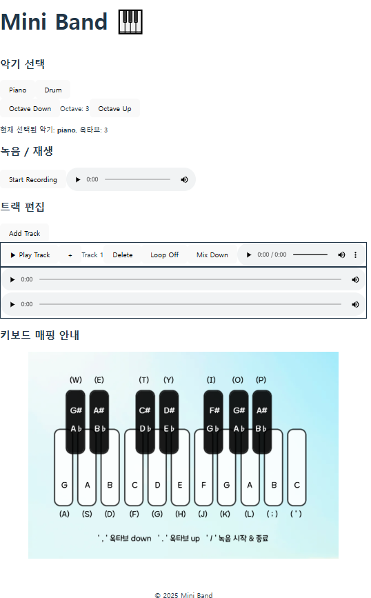

# Mini Band

Tone.js와 Web Audio API를 활용하여 구현한 웹 DAW(Digital Audio Workstation)입니다.

## Usage

### 악기 선택 
악기 선택 tab에서 사용할 악기를 선택합니다.
 
 
아래의 키보드 매핑 안내 이미지에서 키 세팅을 확인하고 키보드를 눌러 연주합니다.
 
 
Piano는 ',' &nbsp;'.'을 눌러 옥타브를 Up & Down 가능합니다.

### 녹음 / 재생
'Start Recording' / 'Stop Recording' 버튼을 토글 or ' / '을 누르는 것으로 녹음이 가능합니다.
 
 
오디오 음원의 재생 버튼을 눌러 녹음된 음원을 재생 가능합니다.
 
음원의 볼륨 슬라이드를 조절하며 볼륨과 mute 설정이 가능합니다.

### 트랙 편집

'Add Track' 버튼을 눌러 트랙을 생성합니다.
 
 
'+' 버튼을 눌러 녹음된 음원을 트랙에 삽입합니다.
 
 
'Loop On' / 'Loop Off' 버튼을 토글시켜 트랙 안의 음원들을 loop 시킬 수 있습니다.
 
 
트랙 안의 음원들의 재생 버튼을 눌러 각각 재생할 수 있고, 트랙의 'Play Track' 버튼을 눌러 트랙 안의 모든 음원을 동시에 재생할 수 있습니다.
 
 
'Mix Down' 버튼을 누르면 트랙 안의 음원들이 하나의 음원으로 융합되어 Mix Down 버튼 옆에 생성됩니다. Mix Down된 음원의 ...을 클릭하여 .wav 확장자의 음원으로 다운 가능합니다.
